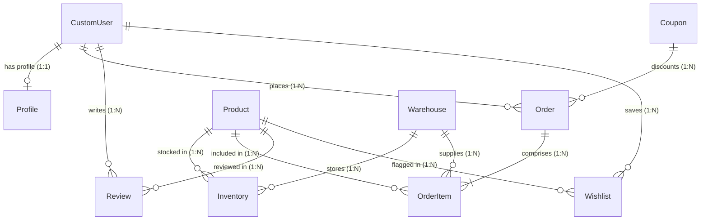

# 📦 Professional Inventory & Order Management API

A comprehensive, production-ready backend system built with **Django** and **Django REST Framework (DRF)**. This API manages product catalogs, warehouse stock allocations, shopping wishlists, customer reviews, dynamic discount coupons, and transactional order dispatch workflows with real-time analytics reports.

---

## 🚀 Key Highlights

*   **Secure JWT Authentication**: Powered by SimpleJWT with token blacklist support on logout and a 7-day access token lifetime.
*   **Role-Based Access Control (RBAC)**: Fine-grained permissions allowing public read-only views for catalogs, customer-specific actions for order placement/tracking, and full-privileged access for admins.
*   **Multi-Warehouse Stock Auto-Routing**: Orders automatically query inventory in the client's `delivery_city` and deduct stock allocations from the city's local warehouse.
*   **Atomic Inventory Restoration**: When an order is cancelled, inventory quantities are securely returned to their respective warehouses within a database transaction block (`@transaction.atomic`).
*   **eSewa Payment Integration**: Generates on-demand base64 encoded PNG QR codes tailored for Nepalese eSewa wallets (`esewa://payment`) containing exact amounts and order metadata.
*   **Built-in Data Caching**: Low-level database query caching implemented on heavy analytical views (`LocMemCache`), caching responses for 60 seconds.
*   **Cloud Storage for Media**: Integrates with Cloudinary to handle dynamic uploads for product images and user profile avatars.
*   **Interactive API Documentation**: Auto-generated Swagger & Redoc pages with interactive schema test consoles via `drf-spectacular`.

---

## 🛠️ Tech Stack

*   **Framework**: [Django 6.0.5](https://www.djangoproject.com/)
*   **REST Toolkit**: [Django REST Framework (DRF) 3.17.1](https://www.django-rest-framework.org/)
*   **Auth Provider**: [DRF SimpleJWT 5.5.1](https://django-rest-framework-simplejwt.readthedocs.io/)
*   **API Schema**: [drf-spectacular 0.29.0](https://drf-spectacular.readthedocs.io/)
*   **Database**: SQLite (Development) / PostgreSQL-ready (with `psycopg2-binary`)
*   **Media Storage**: Cloudinary (Product & Avatar images)
*   **Utilities**: `qrcode` (QR Generation), `django-cors-headers` (CORS middleware), `django-filter` (Query parameters filtering)

---

## 📐 Architecture & Entity Relationships

The codebase utilizes a clean relational architecture to coordinate users, products, warehouses, and orders. The diagram below illustrates these relationships:



---

## ⚙️ Installation & Setup

Follow these steps to run the development server locally:

### 1. Clone & Initialize Environment
```bash
# Clone the repository
git clone https://github.com/your-username/inventory-management-API.git
cd inventory-management-API

# Create a virtual environment
python -m venv venv

# Activate the virtual environment
# On Windows (PowerShell):
.\venv\Scripts\Activate.ps1
# On macOS/Linux:
source venv/bin/activate
```

### 2. Install Dependencies
```bash
pip install -r requirements.txt
```

### 3. Environment Variables Setup
Create a `.env` file in the root directory (or update `config/settings.py` to use `os.getenv` or `decouple`) with your custom API keys:
```env
# Django
SECRET_KEY=your-django-insecure-key
DEBUG=True

# Cloudinary Integration
CLOUD_NAME=your_cloudinary_cloud_name
API_KEY=your_cloudinary_api_key
API_SECRET=your_cloudinary_api_secret

# Image Fetch Fallback (Pexels)
PEXELS_API_KEY=your_pexels_api_key
```

### 4. Database Migrations
```bash
# Apply database schemas
python manage.py migrate

# Create a superuser / admin account
python manage.py createsuperuser
```

### 5. Start Server
```bash
python manage.py runserver
```
The application will be accessible at: `http://127.0.0.1:8000/`

---

## ⚡ Custom Management Commands

The system features utility scripts designed to seed or enrich system data:

### **Generate Dynamic Initials-Based Avatars**
Automatically generates personalized avatar URLs using [ui-avatars.com](https://ui-avatars.com/) for all registered users who have not uploaded a profile picture:
```bash
python manage.py generate_avatars
```

### **Auto-Fetch Product Stock Images**
Scrapes high-quality product images from Pexels API matching the product's name/category, uploads them to Cloudinary, and links them to products lacking images:
```bash
# Fetch missing images
python manage.py fetch_product_image

# Overwrite existing product images
python manage.py fetch_product_image --overwrite
```

---

## 📊 API Endpoint Catalog

A detailed listing of core endpoints. All endpoints under `/api/` require headers formatted as `Authorization: Bearer <your_jwt_access_token>` unless specified as **Public**.

### 🔑 Authentication (`/api/auth/`)
| Method | Endpoint | Access | Description |
| :--- | :--- | :--- | :--- |
| `POST` | `/register/` | **Public** | Registers a new client with the default `customer` role. |
| `POST` | `/login/` | **Public** | Authenticates a user and returns JWT access/refresh tokens. |
| `POST` | `/admin/login/` | **Public** | Authenticates an admin and returns JWT (fails if role != 'admin'). |
| `POST` | `/token/refresh/` | **Public** | Submits a refresh token to generate a new active access token. |
| `GET` | `/me/` | Authenticated | Retrieves profile overview of the logged-in user. |
| `POST` | `/change-password/` | Authenticated | Updates account password. |
| `POST` | `/logout/` | Authenticated | Submits a refresh token to blacklist it, terminating the session. |

### 📦 Products & Warehouses
| Method | Endpoint | Access | Description |
| :--- | :--- | :--- | :--- |
| `GET` | `/api/products/` | **Public** | Lists products. Supports filtering by query params & pagination. |
| `POST` | `/api/products/` | Admin Only | Registers a product. (MIME checking: JPEG/PNG/WebP, size < 2MB). |
| `GET/PUT/DELETE`| `/api/products/{id}/` | Mix (Admin Write) | Retrieve product details (Public), update, or delete it (Admin only). |
| `GET` | `/api/warehouses/` | **Public** | Lists warehouses including GPS coordinates. |
| `POST` | `/api/warehouses/` | Admin Only | Registers a new warehouse. |
| `GET/PUT/DELETE`| `/api/warehouses/{id}/` | Mix (Admin Write) | Retrieve warehouse details (Public), edit, or remove it (Admin only). |

### ⚙️ Inventory & Storage (`/api/inventory/`)
| Method | Endpoint | Access | Description |
| :--- | :--- | :--- | :--- |
| `GET` | `/` | Admin Only | Retrieves all product stock records in various warehouses. |
| `POST` | `/` | Admin Only | Allocates quantity of a product to a specific warehouse. |
| `GET/PUT/DELETE`| `/{id}/` | Admin Only | Retrieve individual inventory record, adjust stock, or remove mappings. |

### 🛒 Customer Orders (`/api/orders/`)
| Method | Endpoint | Access | Description |
| :--- | :--- | :--- | :--- |
| `GET` | `/` | Owner / Admin | List placed orders (Admins see all; Customers see only their own). |
| `POST` | `/` | Authenticated | Places a new order (with auto-routing to local city warehouse & coupon checks). |
| `GET` | `/{id}/` | Owner / Admin | Retrieve full order breakdown including purchase items and pricing. |
| `POST` | `/{id}/cancel/` | Owner / Admin | Cancels order. Stock is automatically returned to original warehouses. |
| `GET` | `/{id}/track/` | Authenticated | Retrieves linear progress status timeline with timestamps. |
| `PATCH`| `/{id}/update-status/`| Admin Only | Transitions status along: `pending` → `processing` → `shipped` → `completed`. |
| `GET` | `/{id}/payment-qr/` | Authenticated | Generates a base64 encoded PNG QR code for direct eSewa payment. |

### 🎟️ Coupons, Reviews & Wishlist
| Method | Endpoint | Access | Description |
| :--- | :--- | :--- | :--- |
| `GET` | `/api/coupons/` | Admin Only | List all promotional discount codes. |
| `POST` | `/api/coupons/` | Admin Only | Create a percentage/fixed amount coupon (auto-uppercases code). |
| `GET/PUT/DELETE`| `/api/coupons/{id}/` | Admin Only | Retrieve, edit, or delete promotional coupons. |
| `GET` | `/api/reviews/` | **Public** | List reviews left by customers on items. |
| `POST` | `/api/reviews/` | Authenticated | Leave a 1 to 5 star rating (constrained to 1 review per product per customer). |
| `GET` | `/api/wishlist/` | Authenticated | Retrieve wishlist catalog for the logged-in customer. |
| `POST` | `/api/wishlist/` | Authenticated | Adds a product to the user's wishlist (unique constraint). |

### 📈 Business Analytics Reports (`/api/reports/`) — *Admin Only*
All reports utilize DRF query-level optimization and are **cached for 60 seconds** to avoid database bottlenecks:
1.  **Inventory Summary (`/inventory-summary/`)**: Returns system totals including total unique products, bulk inventory stock counts, low-stock warnings (quantity < 5), and active order statuses.
2.  **Top Products (`/top-products/?days=30`)**: Lists the top 10 best-selling products by quantity sold and gross revenue generated in the last `X` days.
3.  **Revenue by City (`/revenue-by-city/?days=30`)**: Breaks down total revenue, successful orders, and average order value grouped by delivery cities.
4.  **Top Customers (`/top-customers/?days=30`)**: Ranks the top 10 customers based on cumulative completed order values.
5.  **Sales Trend Chart (`/sales-chart/?period=daily&days=30`)**: Generates chart-ready dates and sales quantities grouped daily or monthly.
6.  **Coupon Usage (`/coupon-usage/`)**: Displays all coupons, usage counts, maximum bounds, active state, and remaining discount allocations.

---

## 📚 API Validation Rules & Guidelines

1.  **Product Name**: Minimum 3 characters. Price must be > 0.
2.  **Warehouse Name**: Minimum 3 characters. City name must be valid.
3.  **Order Routing constraint**: An order item must correspond to a product currently stocked in a warehouse located in the client's `delivery_city` (e.g. "Kathmandu"). If stock is insufficient in that city's warehouse, order validation fails early.
4.  **Review Stars**: Integers in range `[1, 5]`.
5.  **Coupon Limits**: Percentage discounts cannot exceed 100%. Coupons validate expiry dates, active state, and usage limits before deducting order totals.

---

## 📝 Running Tests
Validate business constraints and transaction flows by executing the Django test runner:
```bash
python manage.py test
```

---

## 📖 API Documentation Interfaces
Once the server is running, developer documentation is served automatically:
*   **Swagger Interactive Console**: [http://127.0.0.1:8000/swagger/](http://127.0.0.1:8000/swagger/)
*   **Raw OpenApi Schema (JSON)**: [http://127.0.0.1:8000/api/schema/](http://127.0.0.1:8000/api/schema/)
